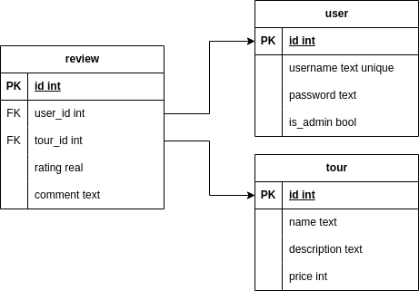

# Start

    git clone https://github.com/kirillsev1/jsTours.git

    cd jsTours

    npm install

    npm start

# App handlers

REST

`GET /rest/tour` - returns all instances of tours

`POST /rest/tour` - returns created tour

`PUT /rest/tour/:id` - updates or creates tour

`DELETE /rest/tour/:id` - removes tour

Auth API

`POST /register` - register new user

`POST /login` - login user with session

`POST /logout` - logout user with session

`GET /user` - returns user creds if auth completed

# App pages

`GET /` - index.html

`GET /login` - login.html

`GET /register` - register.html

`GET /tour_page/:id` - tour.html - tour page with info and reviews

`GET /admin/tour` - admin_essence.html - admin page for tour control

# Db schema

# .env/.env.example

    DB_USER=tours_user

    DB_PASSWORD=tours_password
    
    DB_HOST=localhost
    
    DB_PORT=5432
    
    DB_NAME=tours
    
    SECRET_KEY=your_secret_key
